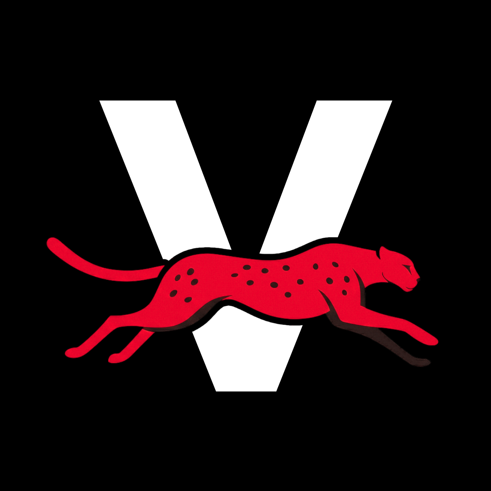

# Velocity | LSE

<div align="center">

</div>

**Velocity** is the LSESU society behind Launchpad and our builder programmes. **Launchpad** is the platform: an AI startup analysis workspace that turns a rough spark into a practical read on the market, customers, risks, and next steps.

## Launchpad

Launchpad takes a founder's early idea and runs it through a structured analysis workflow. It helps answer the questions student builders usually need before they spend weeks building: who the customer is, what problem is sharpest, where the opportunity sits, what could break, and what to build next.

### How it works

1. Describe your startup idea in plain English.
2. Connect an LLM API key when prompted.
3. Launchpad runs the idea through an orchestrated LangGraph workflow:
   - **Idea classification and intake normalization**
   - **Bull analyst** — identifies upside, market opportunity, and momentum
   - **Bear analyst** — stress-tests assumptions, surfaces risks and objections
   - **Synthesis** — merges perspectives into a unified opportunity assessment
   - **QA and repair** — validates the report against the output schema

### What you get

- **Analyst Council** — Bull and bear perspectives with key points and recommendations
- **Confidence Score** — Overall assessment with open risks and next moves
- **Market Sizing** — Directional TAM/SAM/SOM based on reachable communities
- **Competitor Map** — Visual perceptual map showing your gap
- **Customer Segments** — Target demographics with income levels and pain points
- **Monetization Strategy** — Revenue models with pricing suggestions
- **Distribution Channels** — Real communities where your users hang out
- **Prompt Chain** — Step-by-step prompts to build your MVP with AI coding assistants
- **Founder Assets** (optional) — Waitlist landing page and pitch deck, generated on demand

### API key note

Launchpad currently runs through Google Gemini via Google AI Studio. Users paste their own Google AI Studio API key in the browser; Velocity does not store the raw key server-side or sell API access. Keys are stored in browser `sessionStorage` by default, with an optional "remember on this device" setting. Provider terms, billing, data handling, and regional rules still apply.

## Tech Stack

- **Frontend**: React 18, TypeScript, Tailwind CSS, Framer Motion
- **Backend**: Vercel Serverless Functions
- **AI**: LangChain + LangGraph with Google Gemini (`@langchain/google`)
- **Hosting**: Vercel
- **Optional**: Firebase Firestore (for non-Launchpad features)

## Getting Started

### Prerequisites

- Node.js (v18 or higher)
- npm

### Installation

1. Clone the repository:
   ```bash
   git clone https://github.com/LSESU-Velocity/Velocity-Website.git
   cd Velocity-Website
   ```

2. Install dependencies:
   ```bash
   npm install
   ```

3. Set up environment variables:
   ```bash
   cp .env.example .env.local
   ```

4. Configure `.env.local` — see `.env.example` for available variables. Launchpad does not require a platform model API key; users supply their own Google AI Studio key in the browser.

5. Start the API server (needed for Launchpad analysis):
   ```bash
   npm run dev:api
   ```

6. In a separate terminal, start the frontend:
   ```bash
   npm run dev
   ```

7. Open [http://localhost:5173](http://localhost:5173) in your browser.

## Project Structure

```
├── api/                     # Vercel serverless API routes
│   ├── analyze.ts           # Main analysis endpoint (accepts user API key via header)
│   └── analyze-stream.ts    # SSE streaming endpoint with real-time progress
├── components/              # React components
│   ├── Launchpad.tsx        # Main Launchpad UI and input flow
│   ├── LaunchpadDashboard.tsx  # Results dashboard with council, market, and artifacts
│   ├── ApiKeyEntry.tsx      # Google AI Studio key entry modal
│   └── ...
├── lib/                     # Utility and pipeline modules
│   ├── api.ts               # Frontend API client with SSE support
│   ├── launchpad-lab/       # LangChain/LangGraph analysis pipeline modules
│   │   ├── graph.ts         # LangGraph state graph definition and nodes
│   │   ├── schemas.ts       # Zod schemas for analysis contract
│   │   ├── prompts.ts       # Prompt builders for each analysis stage
│   │   ├── analyze.ts       # Analysis runner and outcome types
│   │   └── index.ts         # Barrel exports
│   ├── launchpad-storage.ts # Client-side thread persistence (localStorage)
│   └── ...
├── public/                  # Static assets
└── index.html               # Main HTML entry point
```

## Privacy Note

> Launchpad startup ideas are sent to Google Gemini for analysis using your own Google AI Studio API key. Analyses are stored in your browser only and are not persisted on our servers. Please avoid submitting sensitive personal information or confidential business data. Google processing is subject to Google's own terms and privacy policy.

## Deployment

This project is configured for deployment on Vercel. Connect your GitHub repository to Vercel and configure environment variables in the Vercel dashboard.

## Contributing

This project is maintained by [LSESU Velocity](https://github.com/LSESU-Velocity).

## License

This project is open-source under the [MIT License](LICENSE).

---

<div align="center">

[](https://www.instagram.com/lsesu.velocity)
[](https://www.linkedin.com/company/lsesu-velocity/)

</div>
